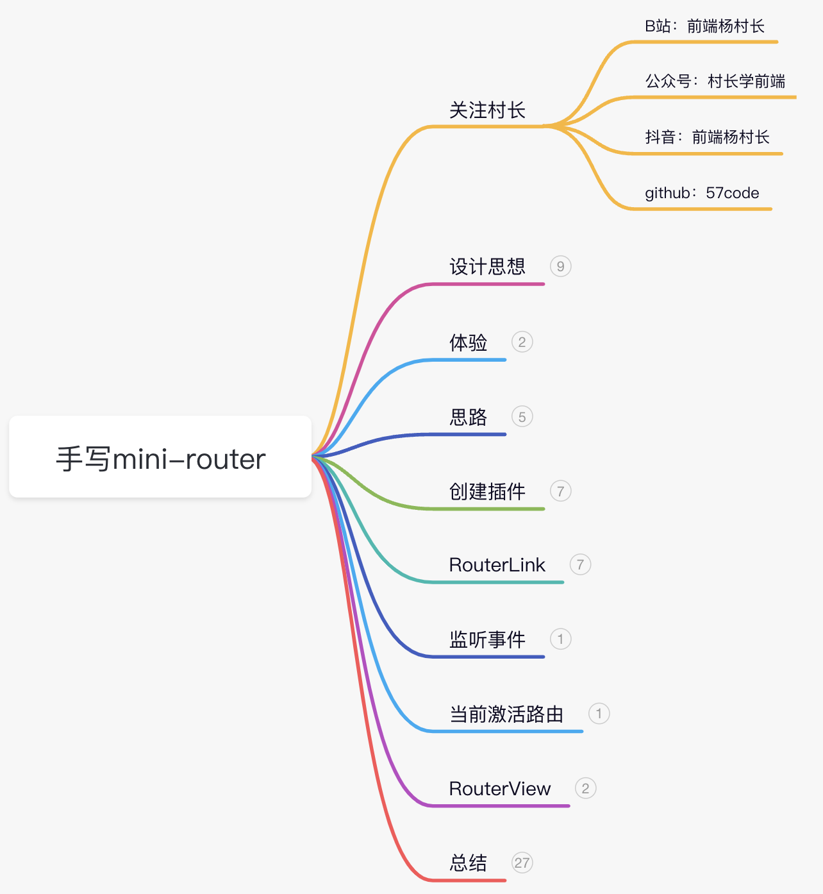

# mini-vue-router
小羊们好，这是村长私教课`Vue3全家桶原理及手写`中产出的代码，想要深入学习Vue全家桶原理的小伙伴可以加我vx：`kkb_cunzhang`。



## 分析

以上是`VueRouter`文档上的介绍，我们想要实现自己的`mini-router`，先来看看它都完成了什么任务：

- 将我们的组件映射到路由上
- 让 VueRouter 知道在哪里渲染它们


## 体验

所以我们的代码会像下面这样写：

- router-link负责路由跳转
- router-view告诉知道在哪渲染组件

```Vue
  <!-- App.vue -->
  <p>
    <!--使用 router-link 组件进行导航 -->
    <!--`<router-link>` 将呈现一个带有正确 `href` 属性的 `<a>` 标签-->
    <router-link to="/">Go to Home</router-link> |
    <router-link to="/about">Go to About</router-link>
  </p>
  <!-- 路由出口 -->
  <!-- 路由匹配到的组件将渲染在这里 -->
  <router-view></router-view>
```


还有个问题是上面的url如何映射到组件，于是有了创建路由时的映射表：

```Vue
// router/index.js
// 1. 引入组件
import Home from "../views/home.vue";
import About from "../views/about.vue";

// 2. 定义一些路由：每个路由都需要映射到一个组件。
const routes = [
  { path: "/", component: Home },
  { path: "/about", component: About },
];

// 3. 创建路由实例并传递 `routes` 配置
const router = createRouter({
  // 4. 内部提供了 history 模式的实现。为了简单起见，我们在这里使用 hash 模式。
  history: createWebHashHistory(),
  routes, // `routes: routes` 的缩写
});

export default router;

```


最后是如何引入到vue中：

```Vue
// main.js
import router from './router'

createApp(App).use(router).mount('#app')

```

## 思路

经过上面分析，我们大致有了思路：

- 定义一个Vue插件作为载体
- 实现两个组件router-view和router-link
- 实现创建路由实例的createRouter()
- 实现创建执行模式的createWebHashHistory()

